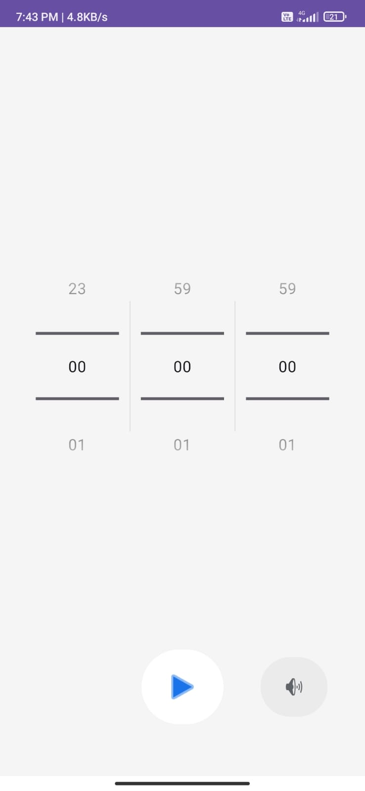
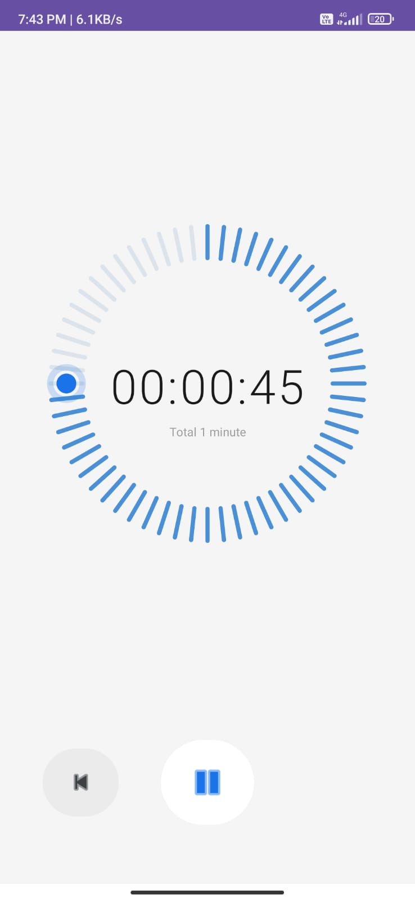
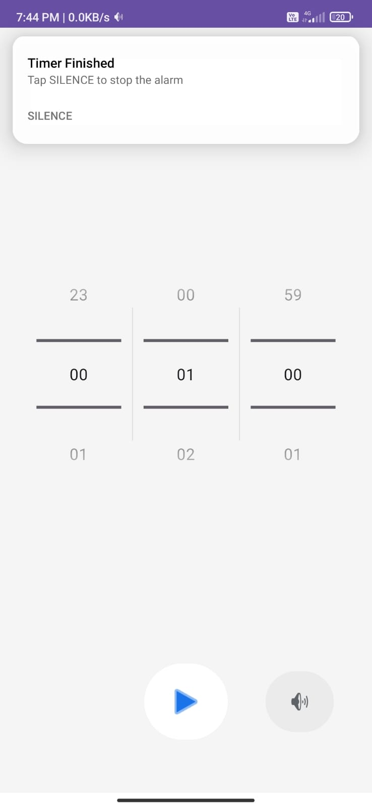

<div align="center">


<br/><br/>

# ⏱️ Timer

**A clean, minimal countdown timer for Android.**  
Set any duration, watch the ring count down, and get a dismissible alarm when time is up.

<br/>

[**⬇️ Download APK**](../../releases/latest) &nbsp;·&nbsp; [Report Bug](../../issues) &nbsp;·&nbsp; [Request Feature](../../issues)

</div>

---

## 📸 Screenshots

<div align="center">
<table>
  <tr>
    <td align="center">
      <br/>
      <sub><b>Set Time</b></sub>
    </td>
    <td align="center">
      <br/>
      <sub><b>Timer Running</b></sub>
    </td>
    <td align="center">
      <br/>
      <sub><b>Alarm Notification</b></sub>
    </td>
  </tr>
</table>
</div>

> **To add your own screenshots:** create a `screenshots/` folder in the repo root and drop in `picker.png`, `running.png`, and `notification.png`.

---

## ✨ Features

- 🕐 &nbsp;Set hours, minutes, and seconds with scroll pickers
- 🔵 &nbsp;Animated 60-tick ring that counts down visually in real time
- 🔴 &nbsp;Stop and Pause/Resume controls during countdown
- 🔔 &nbsp;Alarm fires when the timer ends — plays the device's default alarm sound
- 🔕 &nbsp;Persistent notification with a one-tap **SILENCE** button
- ♿ &nbsp;Fully accessible — all controls have content descriptions
- 🧹 &nbsp;Zero warnings, zero lint errors

---

## 📦 Download & Install

### Option A — Direct APK (no Play Store needed)

1. Go to [**Releases →**](../../releases/latest)
2. Download `Timer-v1.0.apk`
3. On your Android device open the file and tap **Install**
   > You may need to enable *Install from unknown sources* in Settings → Security

### Option B — Build from source

```bash
git clone https://github.com/soares-roydon/Timer.git
cd Timer
./gradlew assembleRelease
```
The signed APK will be at `app/build/outputs/apk/release/app-release.apk`.

---

## 🛠️ Tech Stack

| Layer | Technology |
|---|---|
| Language | Kotlin |
| UI | ConstraintLayout + MaterialButton |
| Custom View | `TimerRingView` — Canvas / Paint |
| Timer | `CountDownTimer` (100 ms ticks) |
| Alarm | `RingtoneManager` + `AudioAttributes` |
| Notification | `NotificationCompat` + `BroadcastReceiver` |
| Min SDK | API 26 (Android 8.0 Oreo) |
| Target SDK | API 35 |

---

## 🗂️ Project Structure

```
app/src/main/
├── java/com/yor/timer/
│   ├── MainActivity.kt        # All timer logic, alarm, notification
│   └── TimerRingView.kt       # Custom canvas view — the animated ring
├── res/
│   ├── layout/
│   │   └── activity_main.xml  # UI layout
│   └── values/
│       └── strings.xml        # All string resources
└── AndroidManifest.xml
```

---

## 🚀 How to Create a GitHub Release (with APK)

1. **Build a signed release APK** in Android Studio:  
   `Build → Generate Signed Bundle / APK → APK → Release`

2. **Create a new release on GitHub:**
   - Go to your repo → **Releases** → **Draft a new release**
   - Set tag: `v1.0`
   - Title: `Timer v1.0`
   - Upload the APK file under *Assets*

3. **The download badge and link in this README will automatically point to the latest release.**

---

## 🔧 Permissions

| Permission | Reason |
|---|---|
| `POST_NOTIFICATIONS` | Show the "Timer Finished" alarm notification (Android 13+) |

No internet, no location, no background services — the app requests only what it needs.

---

## 📄 License

```
MIT License

Copyright (c) 2025 soares-roydon

Permission is hereby granted, free of charge, to any person obtaining a copy
of this software and associated documentation files (the "Software"), to deal
in the Software without restriction, including without limitation the rights
to use, copy, modify, merge, publish, distribute, sublicense, and/or sell
copies of the Software, and to permit persons to whom the Software is
furnished to do so, subject to the following conditions:

The above copyright notice and this permission notice shall be included in all
copies or substantial portions of the Software.

THE SOFTWARE IS PROVIDED "AS IS", WITHOUT WARRANTY OF ANY KIND, EXPRESS OR
IMPLIED, INCLUDING BUT NOT LIMITED TO THE WARRANTIES OF MERCHANTABILITY,
FITNESS FOR A PARTICULAR PURPOSE AND NONINFRINGEMENT.
```

---
